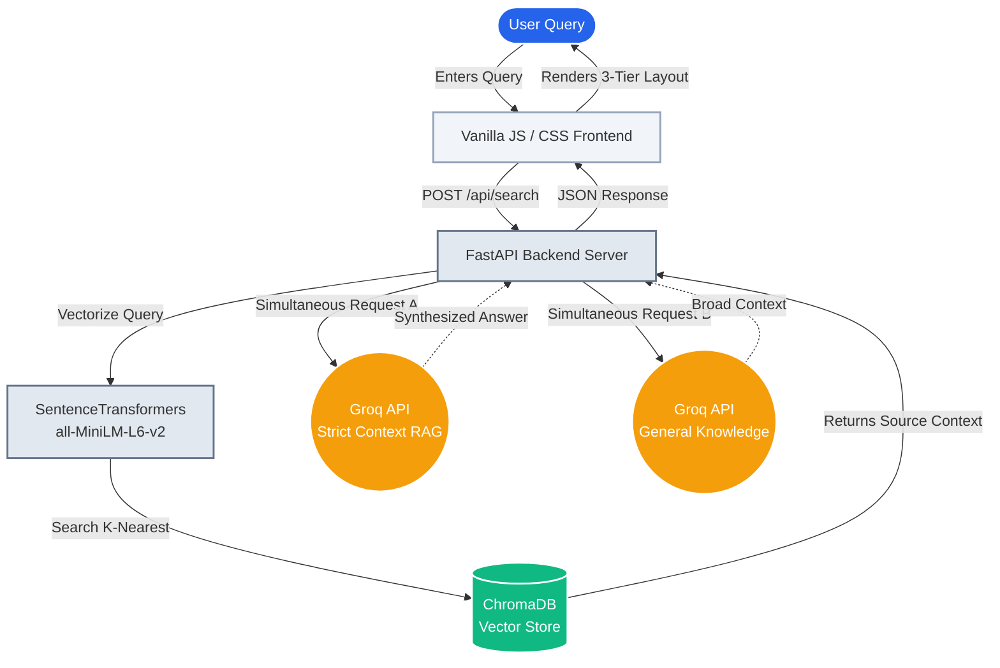

# Dual-Engine RAG & Semantic Search System

## Overview
This project is an advanced **Dual-Engine Retrieval-Augmented Generation (RAG) System**. It goes beyond traditional keyword search by combining dense vector embeddings with ultra-fast LLM inference to provide three simultaneous layers of information:
1. **Semantic Results**: Raw, highly relevant source documents fetched via vector similarity.
2. **Contextual RAG Answer**: A highly synthesized, strict answer grounded *exclusively* in the private source data.
3. **General AI Knowledge**: A broad, worldly perspective drawn from the LLM's baseline training, providing context even when private data is sparse.

Designed with a premium SaaS-style user interface, the system showcases robust backend engineering, cloud API integration, and modern frontend design.

---

## Technical Architecture

### 1. Vector Database & Embeddings
- **ChromaDB**: Utilized as the high-speed, local vector store for lightning-fast similarity searches.
- **SentenceTransformers (`all-MiniLM-L6-v2`)**: Generates 384-dimensional dense semantic embeddings, balancing deep contextual understanding with low latency.

### 2. Dual-Pipeline LLM Integration
- **Groq Cloud API**: Powers the generation pipelines using the `llama-3.1-8b-instant` model.
- **Concurrent Processing**: The backend architecture triggers the RAG synthesis and the General Knowledge synthesis concurrently to drastically reduce user wait times.

### 3. Frontend & UX
- Built with pure **Vanilla HTML/CSS/JS** to demonstrate core frontend proficiency without relying on heavy frameworks.
- Features a custom **CSS Grid layout**, a retractable pull-tab sidebar, and a clean, book-style reading UI for optimal readability.

---

## Architecture Flow



---

## Getting Started

### 1. Prerequisites
- Python 3.8+
- Docker & Docker Compose (for ChromaDB)
- A Groq API Key

### 2. Setup Environment
```bash
# Install dependencies
pip install -r requirements.txt

# Create your environment file
echo 'GROQ_API_KEY="your_api_key_here"' > .env

# Start ChromaDB container
docker compose up -d
```

### 3. Build the Vector Index
The data source is located in `data/docs.txt`. To ingest this into ChromaDB:
```bash
python embed.py          # Step 1: Generate vector embeddings
python insert_vectors.py # Step 2: Store in ChromaDB
```

### 4. Run the Application
Launch the FastAPI server:
```bash
python server.py
```
Open your browser and navigate to `http://localhost:8500`.

---

## Project Structure
- `server.py`: The FastAPI backend handling the search logic and Groq API calls.
- `embed.py`: Logic for converting text to semantic vectors.
- `insert_vectors.py`: Script to ingest data into ChromaDB.
- `public/`: Contains the frontend assets (`index.html`, `styles.css`, `script.js`).
- `docker-compose.yml`: ChromaDB container configuration.

---

## Author
**Suprit Lenkennavar**
AI and Data Science Engineer
